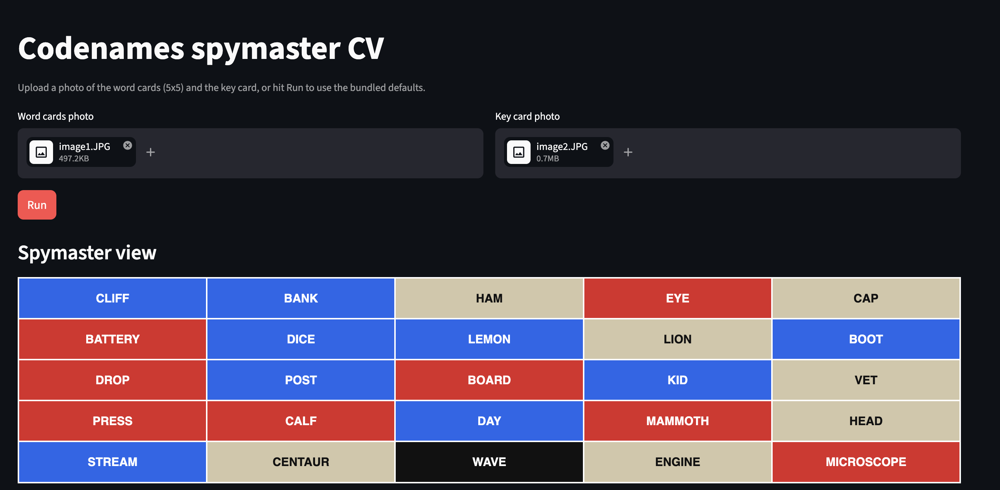
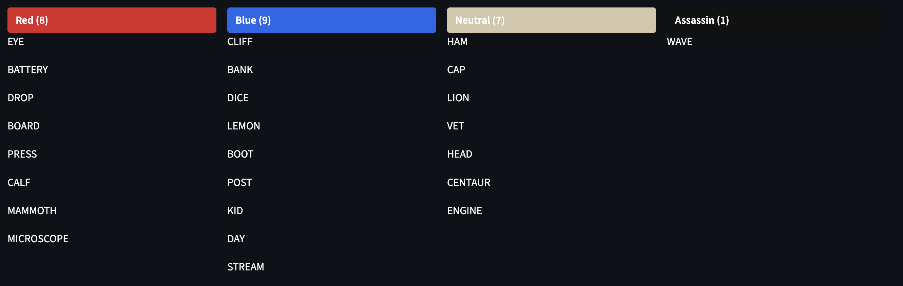
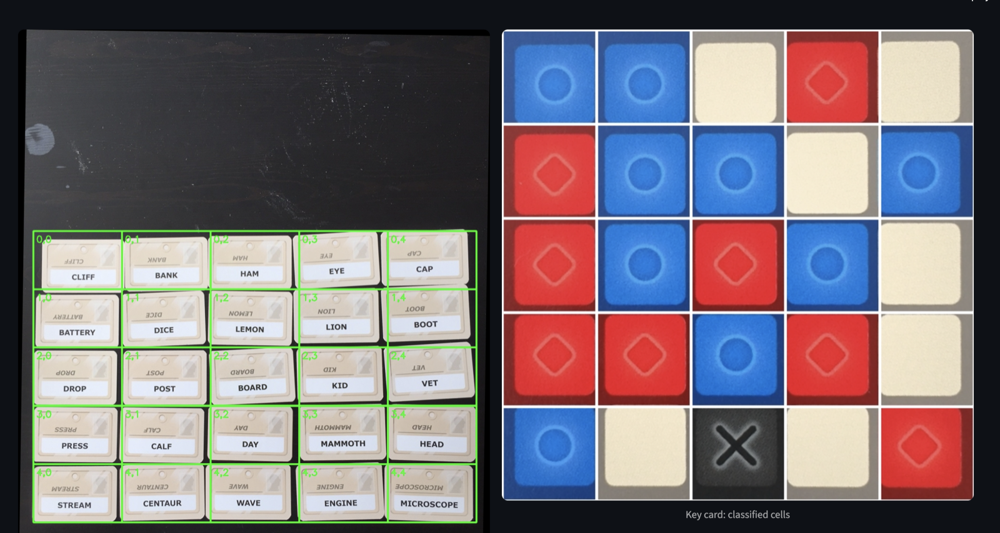

# Codenames CV/OCR

Turn two photos of a Codenames game into the spymaster's view: which words
belong to red, blue, neutral, or the assassin.

- `Images/image1.JPG` — the 5×5 layout of word cards on the table
- `Images/image2.JPG` — the spymaster key card



```python
import cv2
from codenames import analyze

view = analyze(cv2.imread("Images/image1.JPG"), cv2.imread("Images/image2.JPG"))
print(view.red)       # ['EYE', 'BATTERY', 'DROP', ...]
print(view.assassin)  # ['WAVE']
```

## Quick start

```bash
brew install tesseract        # or: apt-get install tesseract-ocr
pip install -r requirements.txt
pytest -v                     # 15 tests
streamlit run app.py          # browser UI — hit Run to use the bundled images
```

The Streamlit app accepts uploads or falls back to the photos in `Images/`,
renders the spymaster grid in team colors, lists each team's words, and shows
debug overlays plus the pre-fuzzy OCR output.



The debug overlays let you eyeball what each stage saw — green boxes on the
detected word-card cells, and a canonical view of the key card with each
cell's classification:



## Architecture

```
codenames/
├── layout.py      # geometric helpers: grid bbox, deskew, slice, perspective warp
├── fuzzy.py       # difflib-based closest-word lookup vs full_word_list.txt
├── word_cards.py  # extract_words(image) -> 5x5 of strings (OCR + fuzzy correct)
├── key_card.py    # extract_colors(image) -> 5x5 of red/blue/neutral/assassin
└── pipeline.py    # analyze(words_img, key_img) -> SpymasterView
```

Both images are sliced into a 5×5 grid along different paths:

- **Word cards** — threshold for bright pixels, aggressively close to fuse
  the 25 cards into one blob, take the largest contour, deskew by its
  min-area-rect angle, slice the bounding box into 5×5 uniform cells, crop
  the bottom half of each cell (the top half is upside-down mirror text),
  OCR with `pytesseract` PSM 6, fuzzy-correct against `full_word_list.txt`.
- **Key card** — HSV-mask the red and blue cells (beige cells are
  indistinguishable from the brown frame), find the bounding rotated
  rectangle of those cells (which spans the full 5×5 grid because at least
  one corner cell is colored), perspective-warp to a canonical square,
  sample each cell's median HSV. Classification: any cell with >20% dark
  pixels is the assassin; otherwise low saturation → neutral, hue in the red
  wedge → red, else blue.

## Public API

```python
from codenames import (
    analyze,          # (words_img, key_img) -> SpymasterView
    extract_words,    # (image) -> WordCardsResult
    extract_colors,   # (image) -> KeyCardResult
)
```

`SpymasterView` exposes `.grid` (5×5 of `(word, team)`) and convenience
properties `.red`, `.blue`, `.neutral`, `.assassin`. The intermediate
results carry debug fields used by the Streamlit overlays.

## Notes for editors

- `full_word_list.txt` is the Codenames base-game word list (~400 entries),
  uppercase, one per line. If you swap it, ensure all 25 words visible in
  `Images/image1.JPG` are still in the list, or `test_word_cards.py` will
  fail.
- HSV thresholds for the key card are module-level constants in
  `codenames/key_card.py` — tune there if a new key-card photo trips them.
- Tests gated on tesseract (`tests/conftest.py` `needs_tesseract`) skip when
  the binary isn't installed; pure-Python tests run unconditionally.
